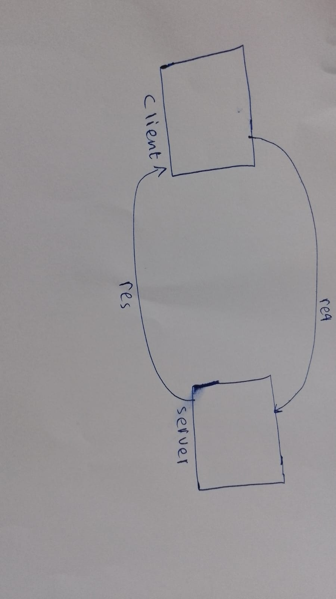

# Movies-Library
# Project Name - Project Version

**Author Name**: Saja Fawaz

## WRRC
Add an image of your WRRC here

## Overview

## Getting Started
<!-- What are the steps that a user must take in order to build this app on their own machine and get it running? -->
1. `npm init -y` to install file `package.json` have information about a server
2. `npm install express cros axios `
3. nodemon to run my server
* HTTP request: get, post, put, delete 
* Express framework for `node.js `
* Steps to start:
1. Require the express and cors 
2. Declear the port `const Port = 3000`

## Project Features
<!-- What are the features included in you app -->
* make status

